<div align="center">

# 真假對決 · Truth or Fake Duel

**看到消息，先查證，再判斷。不確定，就先不轉發。**

給國小學生的 1v1 線上卡牌遊戲，用遊戲練習「媒體識讀」——
學會分辨網路謠言、找證據、做出有根據的判斷。


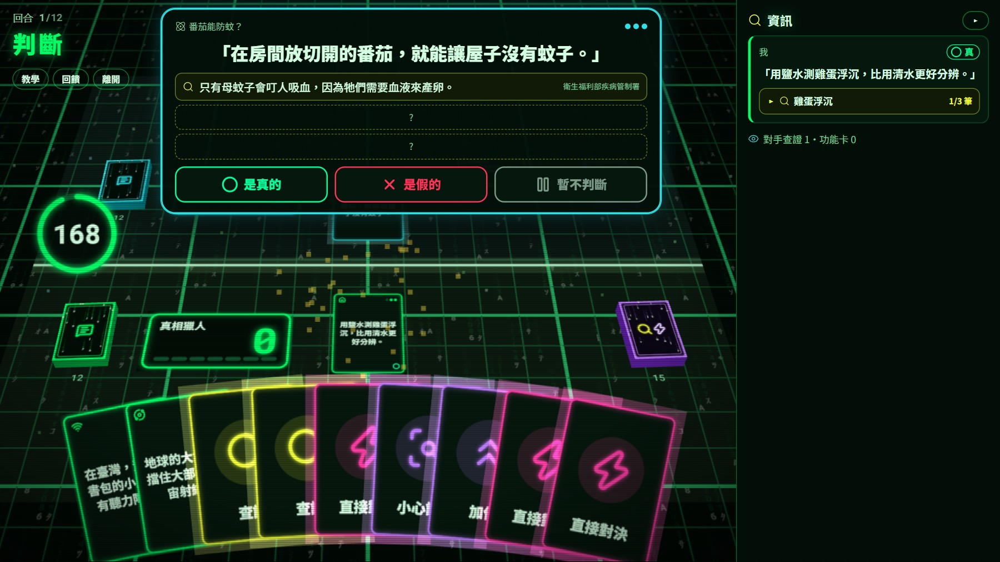

<sub>判斷階段：對手的消息、已查到的證據和三個選項合在同一張浮出的「判斷卡」上，不擋住下方手牌。</sub>

</div>

---

## 這是什麼？

學生每回合各打出一則消息（真的或假的），**只有出牌的人知道答案**。對手要靠「查證卡」一筆一筆公開證據，再決定這則消息是真的、是假的，還是「暫不判斷」。判斷對了得分，判斷錯了扣分，不確定時選「暫不判斷」不扣分——這正是遊戲想教的事：**證據不夠時，先不要相信、也不要轉發。**

- 🎯 **教學目標**：看證據再判斷、辨識常見的假消息手法、知道「不確定」也是一種負責任的選擇
- 👥 **對象**：國小學生，在電腦教室用瀏覽器遊玩（不需要安裝，也不做手機版）
- 🏫 **使用方式**：老師的電腦當伺服器，學生在校內網路輸入網址就能連線

## 特色

| | |
| --- | --- |
| 🕹️ **駭客任務風格的 3D 牌桌** | three.js 繪製的黑底霓虹綠場景：第一視角握在手上的手牌、我方與對手各自的半場、牌庫、抽牌與出牌動畫、結算時的像素粒子 |
| 🔍 **議題組題庫** | 30 個議題，每個議題 3 筆查證資訊 ↔ 3 則消息；查到的證據整局保留，同議題之後再出現就能直接用。學生多玩幾次也很難背答案 |
| 🧠 **偽隨機抽牌** | 功能卡不會一直抽到同一種：查證卡手上最多 3 張、同名最多 2 張、不連抽同一種 |
| 🎓 **新手教學** | 第一次登入自動進入，和「教學小幫手」打 3 回合，每一步跳出說明框，不計牌位 |
| 🏆 **牌位與排行榜** | 6 個牌位、輸了不降級，排行榜只顯示暱稱，保護學生隱私 |
| 🤖 **沒人配對也能玩** | 排隊太久沒有同學時，自動配到電腦玩家（出手速度與判斷力都像學生） |
| 🧑‍🏫 **老師頁** | 顯示學生連線網址、全班戰績、學生回饋；可改不當暱稱、刪除帳號 |
| 🔒 **伺服器是唯一裁判** | 答案與未公開的證據只在需要時才送到瀏覽器，打開開發者工具也看不到 |
| ♿ **純 HTML 備援版** | 網址加 `?nowebgl=1`，沒有 WebGL 的電腦也能完整遊玩 |

## 畫面導覽

### 1. 登入與新手教學

用「年級、班、座號」登入，不用記密碼；姓名可填可不填，填過的下次會自動帶入。第一次登入就會進入教學。

<table>
<tr>
<td width="50%">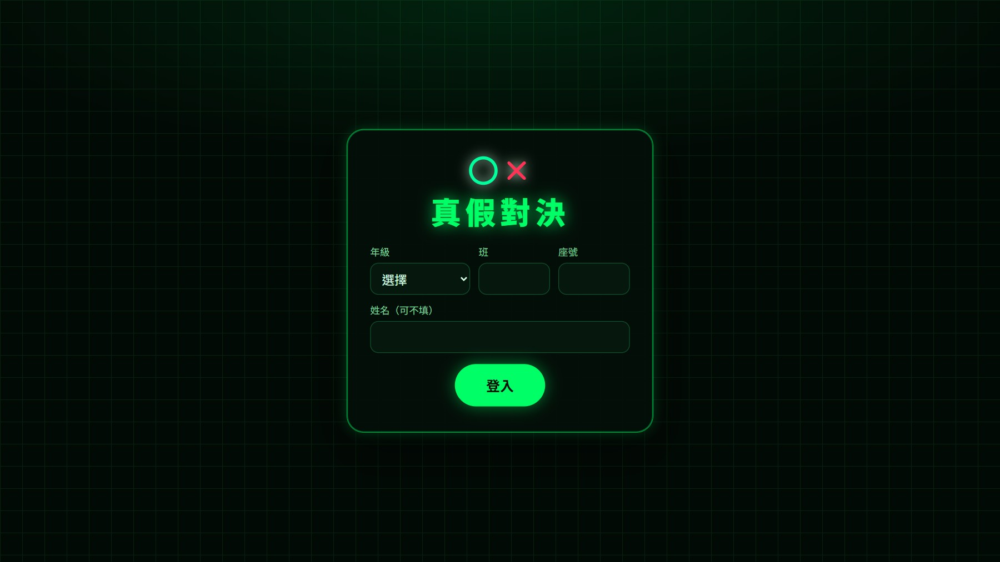<br><sub><b>登入</b>：年級＋班＋座號，姓名選填，下次自動帶入。</sub></td>
<td width="50%">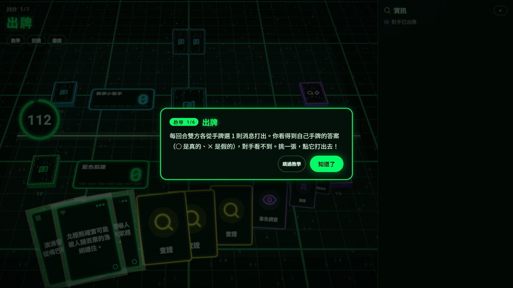<br><sub><b>新手教學</b>：共 6 步，一次一個說明框，按「知道了」才繼續，也可以跳過。</sub></td>
</tr>
</table>

### 2. 對局：出牌與判斷

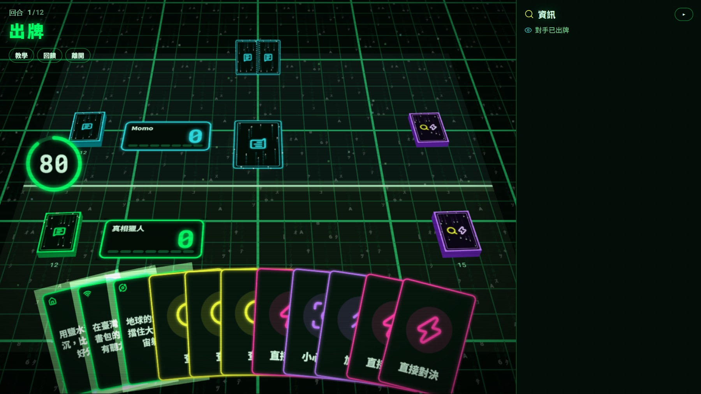

- **左上角**：回合數、階段名稱（出牌、翻牌、判斷、對決、結算），下面是教學、回饋、離開按鈕。
- **倒數**：環形倒數畫在桌面分隔線旁，剩 10 秒變紅。
- **兩個半場**：遠端是對手（青色），近端是我（綠色）；比分直接畫在各自半場的比分牌上。
- **牌庫**：左邊消息牌庫、右邊實用牌庫，前面的數字是剩餘張數。
- **手牌**：握在畫面下緣的第一視角扇形；滑鼠指到的牌會抬起、放大，點一下就打出或使用，詳細說明只在指到時才出現，卡面保持乾淨。
- **右側資訊區**：查到的證據依議題收合，點議題名稱才展開；可以整個收成窄條。

### 3. 結算：霓虹光暈與像素粒子

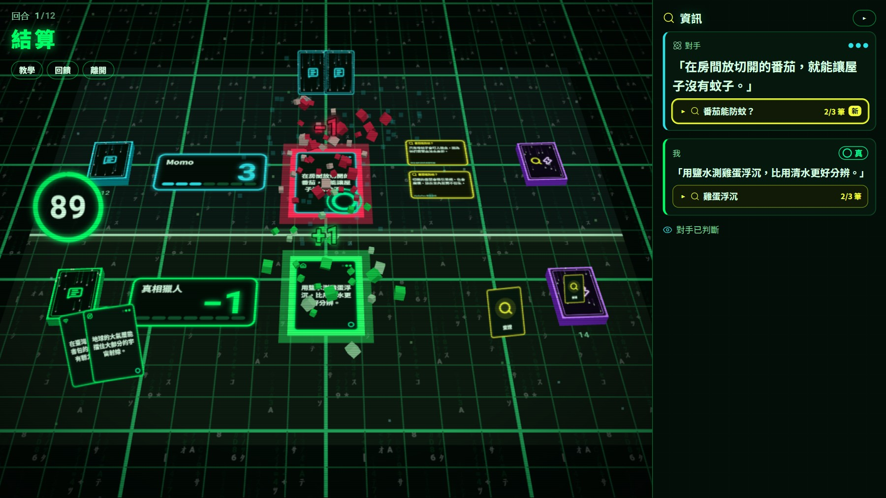

雙方都選完後，回到牌桌看加扣分演出：**螢光綠＝判斷正確、紅＝判斷錯誤、橙＝不加不扣**，卡片上方浮出 `+1` / `−1`，同時噴出立體像素粒子。約 2.6 秒後才跳出回合結果。

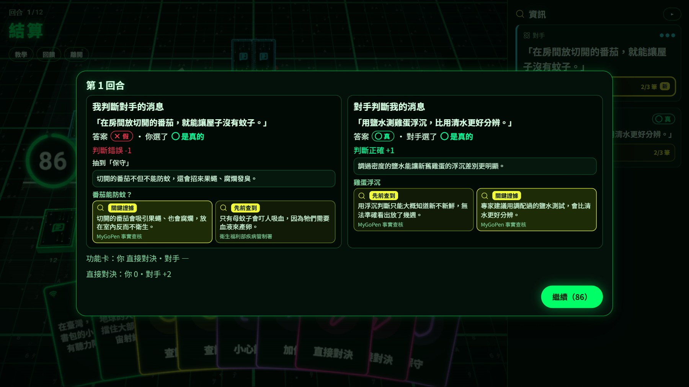

回合結果左右兩欄分別是「我判斷對手」與「對手判斷我」：答案、選擇、得分、為什麼，以及這個議題的證據（黃色是關鍵證據）。資訊排成兩排，一頁看完不用捲動。

### 4. 直接對決

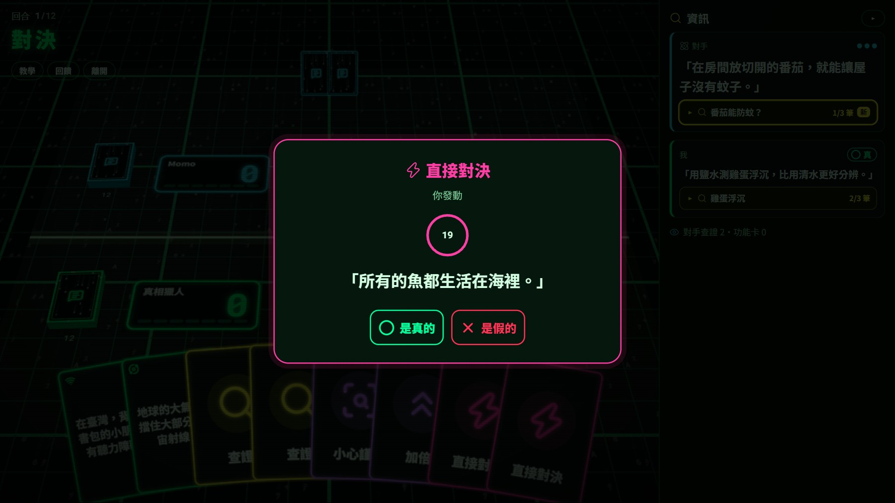

使用「直接對決」功能卡，雙方同時搶答一題是非題：**答對且比對手快 +2、答對但較慢 +1、答錯或不作答 0 分（不扣分）**。對決期間主計時暫停。

### 5. 首頁、排行榜與回饋

<table>
<tr>
<td width="50%">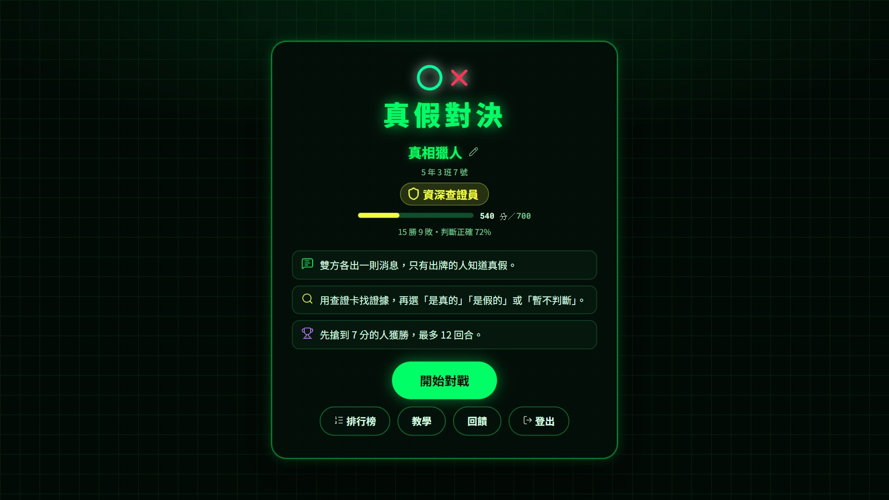<br><sub><b>首頁</b>：暱稱（可自己改）、牌位與進度、勝敗與判斷正確率。</sub></td>
<td width="50%">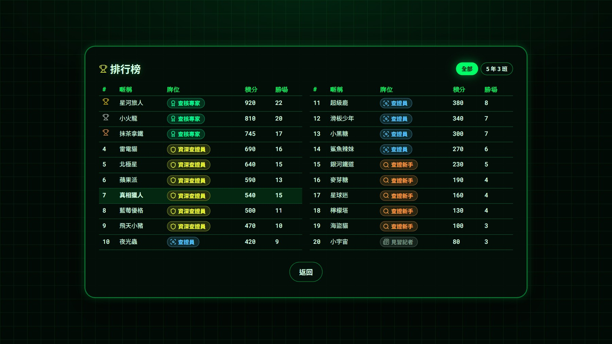<br><sub><b>排行榜</b>：只顯示暱稱；全部／本班兩個分頁；前 20 名分兩欄，一頁看完。</sub></td>
</tr>
<tr>
<td width="50%">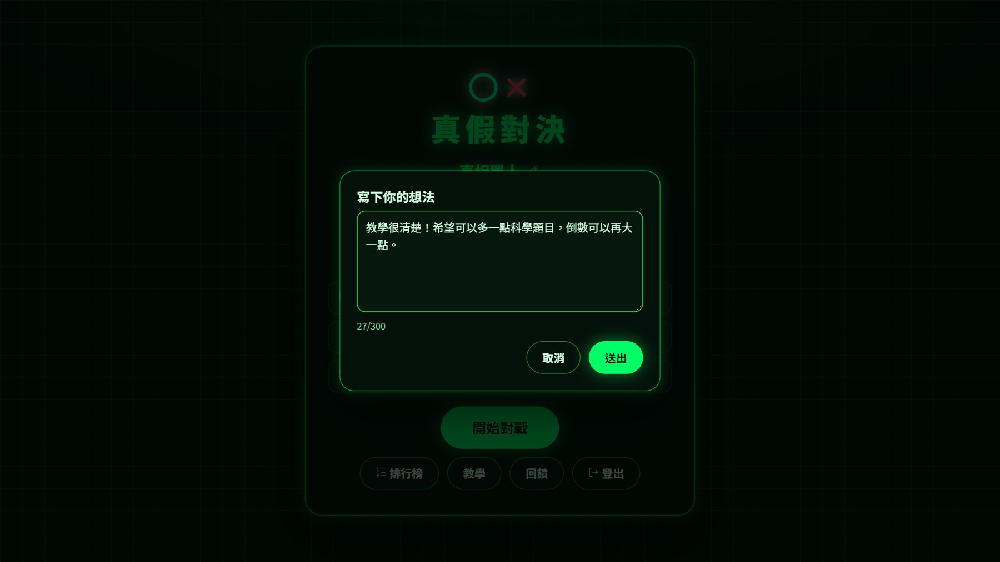<br><sub><b>回饋</b>：學生寫下想法（最多 300 字），老師在老師頁看得到。</sub></td>
<td width="50%">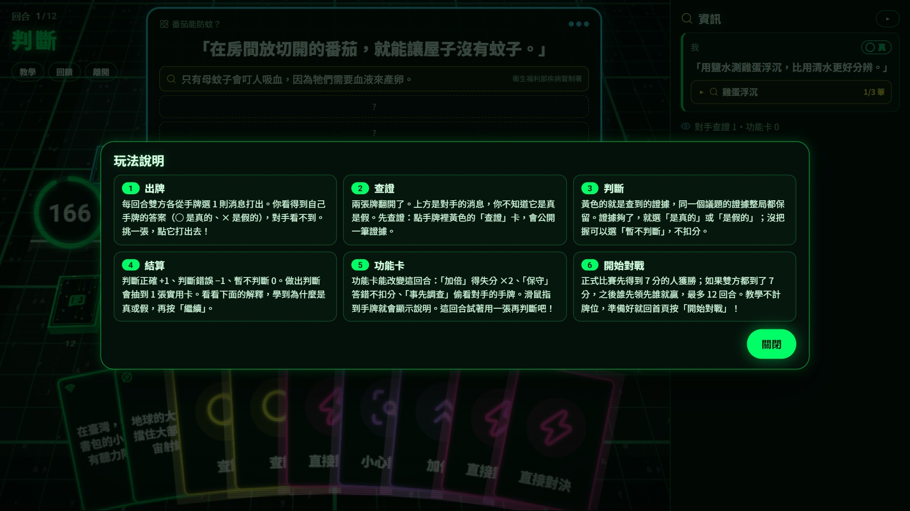<br><sub><b>玩法說明</b>：對局中按「教學」隨時回頭看全部步驟，不會離開這一局。</sub></td>
</tr>
</table>

### 6. 老師頁

只能在執行伺服器的那台電腦開啟（`http://localhost:3000/teacher`），從其他電腦連進來會被擋下。

<table>
<tr>
<td width="50%">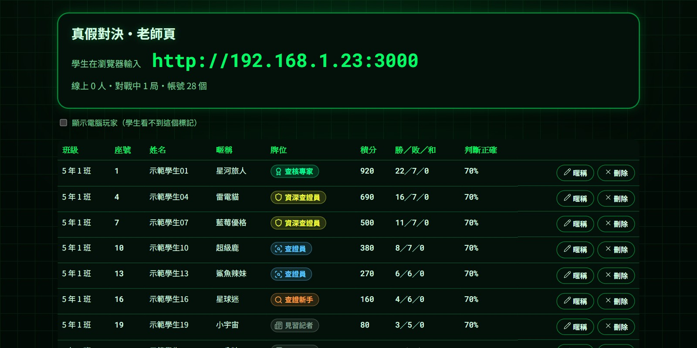<br><sub>大字顯示學生要輸入的網址（可直接投影）、線上人數、全班帳號與戰績；可改暱稱、刪除帳號。（截圖中的網址與學生皆為示範資料）</sub></td>
<td width="50%">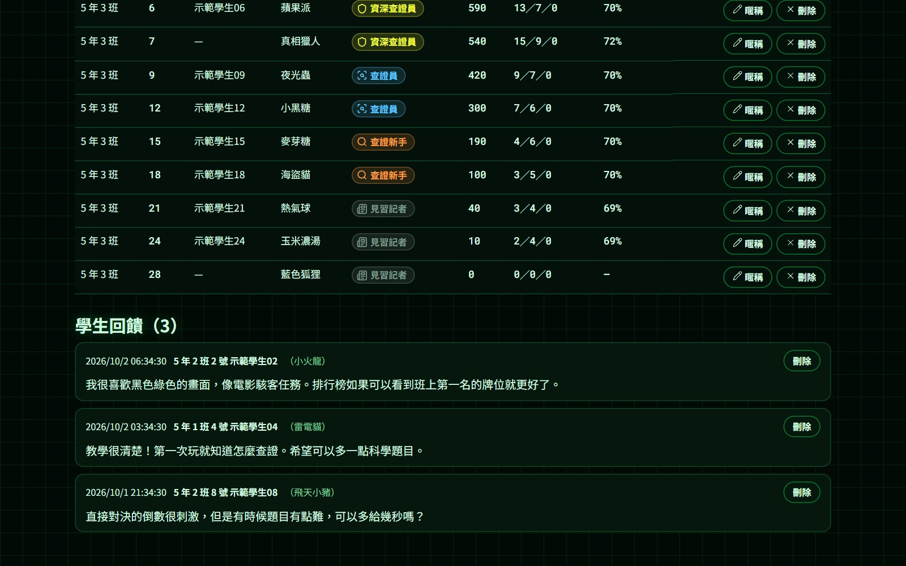<br><sub>最下方列出學生寫的回饋，附時間、班級座號與暱稱，可刪除。</sub></td>
</tr>
</table>

---

## 遊戲規則

### 回合流程

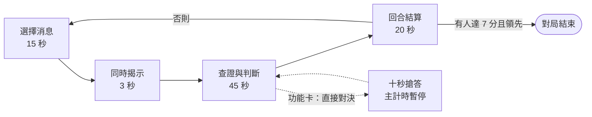

1. **選擇消息**：每人從手牌選 1 則消息打出。自己看得到答案，對手看不到。
2. **同時揭示**：雙方的牌同時翻開。
3. **查證與判斷**：用查證卡公開對手消息的證據；用功能卡改變局面；最後選「是真的／是假的／暫不判斷」。
4. **回合結算**：公布答案與解釋，更新比分，做出判斷的人抽 1 張實用卡。

### 計分

| 你的選擇 | 判斷正確 | 判斷錯誤 |
| --- | :---: | :---: |
| 是真的 ／ 是假的 | **+1** | **−1** |
| 暫不判斷 | 0 | 0 |

- **勝負**：搶先到 **7 分**且領先的人獲勝。如果雙方都到了 7 分且同分，繼續打，之後誰先領先誰就贏；最多 12 回合，打滿比總分。
- **逾時**：沒在時間內鎖定判斷，視為「暫不判斷」。
- **離線**：連續斷線 90 秒判負。

### 實用卡

每人一副 20 張的實用牌庫（10 張查證卡＋10 張功能卡）。開局手牌是 2 張消息卡、3 張查證卡、1 張功能卡；手牌上限消息卡 5 張、實用卡 8 張，滿了就不抽。

| 卡片 | 效果 |
| --- | --- |
| 🔍 **查證** | 公開對手消息的 1 筆查證資訊 |
| ✖️ **加倍** | 本回合判斷的得失分 ×2 |
| 🛡️ **保守** | 本回合判斷錯誤不扣分 |
| 🧐 **小心謹慎** | 下一張查證卡公開 2 筆資訊 |
| 👁️ **事先調查** | 查看對手 1 張手牌；是消息卡就得 1 張查證卡 |
| 📣 **網路風傳** | 抽 1 張消息卡 |
| 🔄 **重新再來** | 把其他功能卡全部換成新的 |
| ⚡ **直接對決** | 發動 10 秒搶答（每回合全場最多 1 場） |

### 牌位

贏一局 +20、輸一局 −10、平手 +5。**輸了不會掉出目前的牌位**，避免小朋友連輸後不想玩。

| 見習記者 | 查證新手 | 查證員 | 資深查證員 | 查核專家 | 事實守護者 |
| :---: | :---: | :---: | :---: | :---: | :---: |
| 0 | 100 | 250 | 450 | 700 | 1000 |

---

## 題庫設計

> 遊戲最重要的是「消息」與「查證內容」怎麼配置。

- **議題組**：30 個議題，每個議題剛好 **3 筆查證資訊**與 **3 則消息**，每筆資訊都是其中一則消息的關鍵證據。每局抽 10 個議題（30 張消息卡）。
- **整局累積**：查到的證據留在「本局資訊庫」，之後同議題的消息會直接顯示已公開的證據——不會查了一堆之後再也用不到。
- **不容易背答案**：同一議題以不同說法反覆出現；系統會記住每位學生玩過的議題，下次優先抽沒看過的。
- **真假各半**：90 張消息卡中真消息約 44%；每個議題至少 1 真 1 假，避免學生靠「都猜假的」得分。
- **直接對決題**：另有 40 題是非題，每題附解釋與來源。
- **驗證工具**：`npm run validate` 與伺服器啟動時都會檢查題庫（每議題 3 筆資訊、關鍵證據對應、字數上限、重複題目等），不通過就拒絕啟動。

假消息改寫自事實查核網站（MyGoPen、台灣事實查核中心）查核過的真實謠言；查證資訊取自查核報告引述的專家與機關說法。題庫在 [`content/topics.ts`](content/topics.ts)，照既有格式新增議題即可。

## 快速開始

需要 [Node.js](https://nodejs.org) 22 以上。

```bash
git clone https://github.com/OWNER/truth-or-fake-duel.git
cd truth-or-fake-duel
npm install
npm run build      # 建置前端到 dist/
npm start          # 啟動伺服器，預設 http://localhost:3000
```

啟動時終端機會印出「學生在瀏覽器輸入」的區域網路網址。開兩個瀏覽器分頁、各用不同座號登入就能自己對打；排隊 10–22 秒沒有人時會配到電腦玩家。

| 選項 | 說明 |
| --- | --- |
| `--port 4000` 或 `PORT` | 換埠號 |
| `--config 路徑` 或 `ZJ_CONFIG` | 換設定檔（目標分、回合數、各階段秒數、牌庫組成） |
| `--data 路徑` 或 `ZJ_DATA` | 換帳號資料檔（預設 `data/players.json`） |
| 網址加 `?nowebgl=1` | 強制用純 HTML 版（沒有 3D），給效能較弱的電腦 |
| 網址加 `?perf` | 開發用：把 three.js 狀態掛到 `window.__r3f`，方便量測效能 |

## 課堂使用（老師電腦當伺服器）

1. **啟動**：Windows 直接雙擊 [`start-class.bat`](start-class.bat)；第一次會自動安裝套件、建置畫面，約 1–2 分鐘（需要連外網）。其他系統用上面的 `npm start`。
2. **防火牆**：第一次啟動時 Windows 會詢問，勾「私人網路」後按「允許存取」，學生才連得進來。
3. **公布網址**：視窗會印出「學生在瀏覽器輸入」的網址，例如 `http://192.168.1.23:3000`，寫在黑板或投影出來。學生的電腦要和老師電腦在同一個校內網路，用 Chrome 或 Edge 開啟。
4. **學生登入**：用年級、班、座號登入（姓名選填，會自動帶入上次的）；第一次登入會自動進入新手教學。
5. **老師頁**：在這台電腦開 `http://localhost:3000/teacher`，看連線網址、線上人數、全班戰績、學生回饋，也可以改不當暱稱、刪除登記錯的帳號與回饋。
6. **下課**：在終端機按 `Ctrl+C` 關閉。帳號與積分存在 `data/players.json`，下次啟動接著用；換電腦時把這個檔案一起帶走。

連不上的常見原因：防火牆擋了埠號、學生與老師電腦不在同一個網段、老師電腦的 IP 改變了（以終端機印出的為準）。

## 技術架構

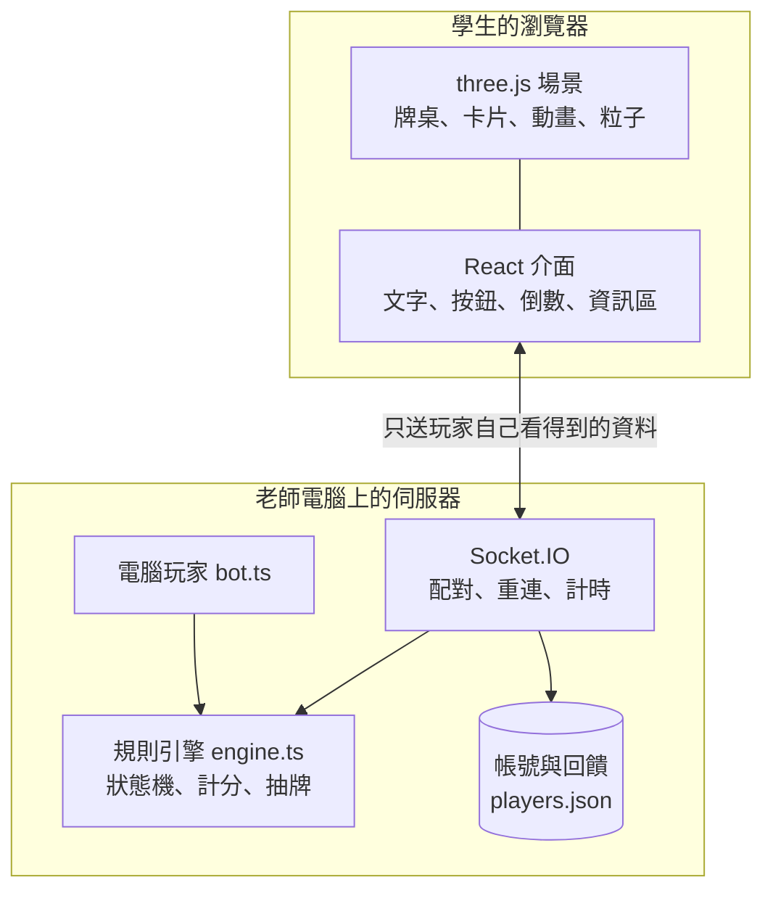

- **伺服器權威**：所有規則都在 [`server/engine.ts`](server/engine.ts)（狀態機，不碰網路，可單獨測試）；每次狀態改變，伺服器為每位玩家各算一份「他看得到的視圖」，答案與未公開的證據不會出現在送出的資料裡。
- **兩層畫面**：three.js 畫布只負責場景、卡片與動畫（`aria-hidden`）；文字、按鈕、倒數與資訊區都在 HTML 層，中文清晰、螢幕閱讀器可用，WebGL 不能用時也能完整遊玩。
- **不用外部 3D 模型**：卡面用 Canvas 繪製（文字、Lucide 線條圖示、代碼雨圖案）再當貼圖；桌面是一張可重複的格線貼圖。
- **流暢度**：每幀繪製成本很低——格線用貼圖而非 shader、牌庫是單一方塊、光暈與邊框只在需要時才建立、解析度依實際流暢度自動在 1～1.5 倍間調整。在 Intel UHD 630 內顯上每幀約 2 毫秒。
- **視窗適應**：對局中整頁固定、不出現捲軸；各畫面在常見的筆電視窗（約 1366×650）填滿不捲動。

<details>
<summary><b>專案結構</b></summary>

| 位置 | 內容 |
| --- | --- |
| `content/config.json` | 目標分、回合上限、開局手牌、手牌上限、實用牌庫組成、各階段秒數 |
| `content/topics.ts` | 30 個議題組（每議題 3 筆查證資訊 ↔ 3 則消息，共 90 張消息卡） |
| `content/duels.ts` | 40 題直接對決題 |
| `server/engine.ts` | 對局規則（開局、查證、功能卡、計分、直接對決、勝負、偽隨機抽牌） |
| `server/app.ts` | 登入、配對（含電腦玩家）、連線、重連、計時、牌位結算、教學、回饋、老師頁 API |
| `server/store.ts` | 帳號資料檔、排行榜、回饋、輸入檢查 |
| `server/bot.ts` | 電腦玩家的帳號與出手邏輯 |
| `shared/` | 前後端共用的型別、圖示、牌位規則 |
| `client/scene/` | three.js 場景、卡面貼圖、像素粒子 |
| `client/ui/` | 登入、首頁、對局、結算、教學、回饋、排行榜、老師頁 |
| `tests/` | 自動測試；`tests/fixtures/showcase-config.json` 是手動測試用的設定（功能卡多、倒數長） |

</details>

## 開發與測試

```bash
npm run dev        # 伺服器 3001 ＋ Vite 5173，前端改了即時更新
npm test           # 67 項測試
npm run typecheck  # TypeScript 型別檢查
npm run validate   # 只驗證題庫與設定
```

測試涵蓋規則引擎（含 30 局隨機亂玩到結束）、題庫驗證、帳號與牌位、電腦玩家對戰、新手教學、回饋，以及用兩個真實連線的客戶端自動打完整局，並逐一檢查送到前端的每份資料沒有洩漏答案。

## 資料與聲明

- 帳號與回饋存在本機的 `data/players.json`（已加入 `.gitignore`，不會上傳）。登入只用年級、班、座號，**不設密碼**，適合在老師看得到的課堂使用；若要放到公開網路，請先加上密碼與老師密碼。
- 排行榜與畫面只顯示暱稱；老師頁才看得到登記的姓名。
- 題庫中的假消息是依事實查核網站報告改寫的教學用途內容，並非原文轉載；若有疑慮請開 issue。
- 授權：尚未指定。
